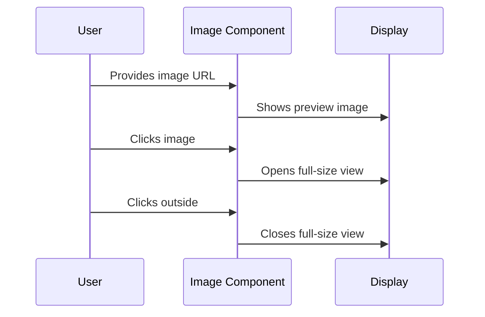

# Chapter 1: Image Component

Have you ever needed to display images on a website in a way that lets users easily view both thumbnails and full-size versions? That's exactly what our Image Component solves! Think of it like a smart photo frame that can show both small preview images and expand to show the full picture when clicked.

## Why Do We Need This?
Imagine you're building a photo gallery for a pet adoption website. You want to:
- Show small preview images of pets
- Let users click to see larger versions
- Handle cases where images might be missing
- Make it look consistent across your site

## Understanding the Basics
Let's break down the Image Component into simple parts:

1. **Preview Mode**: The small version of the image that appears first
2. **Full-size Mode**: The larger version that appears when clicked
3. **Missing Image Handler**: A fallback image when nothing is available

## How to Use It
Here's a simple example of how to use the Image Component:

```jsx
import { Image } from 'common';

function PetProfile() {
  return (
    <Image 
      image="https://example.com/cute-puppy.jpg"
      size={3.5}
      canOpen={true}
    />
  );
}
```

This code creates:
- A small preview image (3.5em × 3.5em)
- A clickable interface to see the full image
- A search icon in the corner to indicate it's expandable

## Key Features
The component comes with several helpful props:

```jsx
interface IImageProps {
  image: string | null;     // URL of the image
  canOpen?: boolean;        // Can it be clicked to expand?
  size?: number;           // Size in em units
  borderRadius?: string;   // Custom border radius
  withBorder?: boolean;    // Add a border?
}
```

## How It Works Under the Hood
Let's see what happens when someone uses the Image Component:



## Internal Implementation
The component uses styled-components for styling and handles three main states:

1. **Normal Display**:
```jsx
const InnerWrapper = styled.div`
  width: ${props => props.size}em;
  height: ${props => props.size}em;
  overflow: hidden;
  border-radius: 12px;
`;
```
This creates the basic container for our image.

2. **Interactive Elements**:
```jsx
const OpenButton = styled.div`
  position: absolute;
  bottom: 3px;
  right: 3px;
  cursor: pointer;
`;
```
This adds the clickable search icon in the corner.

The component connects with several other features that we'll explore in later chapters:
- [Modal Preview System](02_modal_preview_system_.md) for full-size viewing
- [Styled Components System](03_styled_components_system_.md) for consistent styling
- [Animation Transitions](05_animation_transitions_.md) for smooth interactions

## Conclusion
You now understand the basics of the Image Component - a simple yet powerful way to display images with preview functionality. In the next chapter, we'll explore how the [Modal Preview System](02_modal_preview_system_.md) works to show those beautiful full-size images.

Remember: The Image Component is like a smart photo frame that not only displays your images but also helps users interact with them in an intuitive way!

---

Generated by [AI Codebase Knowledge Builder](https://github.com/The-Pocket/Tutorial-Codebase-Knowledge)