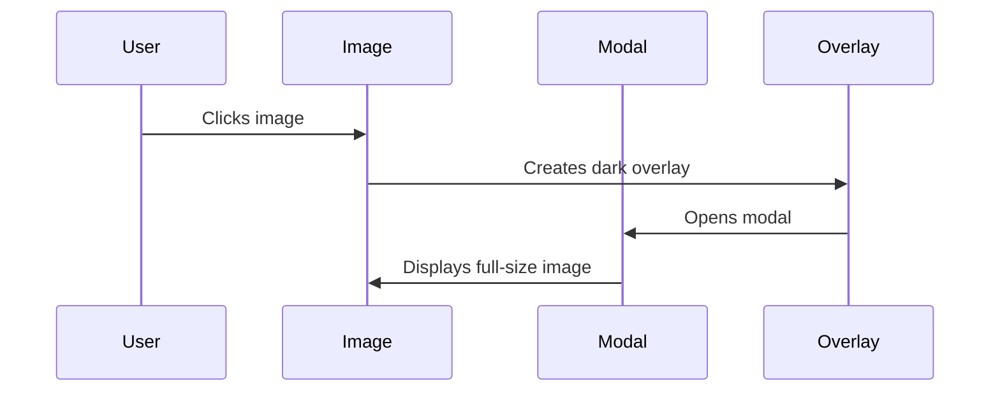

# Chapter 2: Modal Preview System

Coming from our previous [Image Component](01_image_component_.md) chapter, you learned how to display images in their preview form. Now, let's explore how to show them in their full glory when users want a closer look!

## What's a Modal Preview System?

Think of it like a theater's main stage spotlight. When you click an image, everything else dims (like theater lights going down), and your image takes center stage in a beautiful full-screen display. It's perfect for when users want to see every detail of an image without distractions.

## Why Do We Need This?
Imagine you're building a photography portfolio website. You want to:
- Show thumbnail images in a grid
- Let users click to see high-resolution versions
- Dim the background to focus attention
- Allow easy closing with a click outside

## How to Use It

Here's a simple example:

```jsx
<Image 
  image="https://example.com/photo.jpg"
  canOpen={true}  // Enables the modal preview
  size={3.5}
/>
```

When users click either the image or the search icon, the modal preview system activates, showing:
- A dimmed overlay covering the whole page
- The full-size image centered on screen
- Click-outside-to-close functionality

## How It Works

Let's see what happens when someone clicks an image:



## Key Components

### 1. The Overlay
```jsx
const PopupOverlay = styled.div`
  position: fixed;
  top: 0;
  left: 0;
  width: 100%;
  height: 100%;
  background: rgba(0, 0, 0, 0.7);
  display: flex;
  justify-content: center;
  align-items: center;
`;
```
This creates the dimmed background that helps focus attention on the image.

### 2. The Gallery Wrapper
```jsx
const GalleryWrapper = styled.div`
  display: flex;
  flex-direction: column;
  align-items: center;
  justify-content: center;
  height: 100%;
  padding: 50px;
`;
```
This centers the image perfectly in the middle of the screen.

## Handling User Interactions

The system responds to user actions:

```jsx
<PopupOverlay
  onClick={() => {
    setOpen(false);  // Close when clicking outside
    trackCloseEvent();  // Track user behavior
  }}
>
  <ImageFull 
    onClick={e => e.stopPropagation()} 
    src={image} 
  />
</PopupOverlay>
```

This code:
- Closes the preview when clicking the dark background
- Prevents closing when clicking the actual image
- Integrates with our [Event Tracking](06_event_tracking_.md) system

## Animation Integration

The modal system works seamlessly with our [Animation Transitions](05_animation_transitions_.md) to provide smooth opening and closing effects:

```jsx
<MountTransition open={open}>
  {/* Modal content here */}
</MountTransition>
```

## Styling Consistency

The modal preview system uses our [Styled Components System](03_styled_components_system_.md) to maintain consistent styling across the application, including:
- Proper spacing
- Consistent colors
- Responsive behavior through our [Responsive Sizing System](04_responsive_sizing_system_.md)

## Conclusion

You now understand how the Modal Preview System creates an immersive viewing experience for your images. It's like giving each image its own moment in the spotlight! In the next chapter, we'll explore how to make everything look consistent with our [Styled Components System](03_styled_components_system_.md).

---

Generated by [AI Codebase Knowledge Builder](https://github.com/The-Pocket/Tutorial-Codebase-Knowledge)