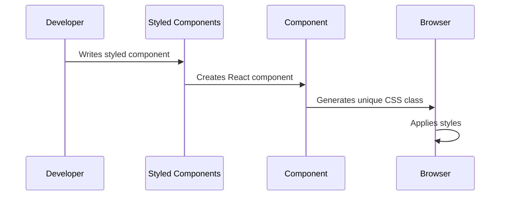

# Chapter 3: Styled Components System

Building on our [Modal Preview System](02_modal_preview_system_.md), let's explore how to make our components look beautiful and consistent using styled-components. Think of it as creating a fashion designer for your React components!

## Why Do We Need This?

Imagine you're building a design system for your application where:
- Every button should look consistent
- Colors should match your brand
- Spacing should be uniform
- Styles should change based on props (like disabled state)

## Understanding the Basics

Let's break down styled-components with a simple example:

```jsx
import styled from 'styled-components';

const Button = styled.button`
  background: ${props => props.primary ? '#007bff' : 'white'};
  color: ${props => props.primary ? 'white' : '#007bff'};
  padding: 10px 20px;
  border-radius: 4px;
`;
```

This creates a button that can be either primary (blue background) or secondary (white background) based on props!

## How It Works



## Key Features

### 1. Props-Based Styling
```jsx
const Box = styled.div`
  background: ${props => props.bgColor || 'white'};
  padding: ${props => props.large ? '20px' : '10px'};
`;
```
Use it like this:
```jsx
<Box bgColor="blue" large>Hello!</Box>
```

### 2. Theme Support
```jsx
const theme = {
  colors: {
    primary: '#007bff',
    secondary: '#6c757d'
  },
  spacing: {
    small: '8px',
    medium: '16px'
  }
};
```

Then use it in components:
```jsx
const Card = styled.div`
  padding: ${({ theme }) => theme.spacing.medium};
  color: ${({ theme }) => theme.colors.primary};
`;
```

### 3. Extending Styles
```jsx
const Button = styled.button`
  padding: 10px;
`;

const BigButton = styled(Button)`
  font-size: 20px;
`;
```

## Real-World Example

Let's style our Image component from earlier chapters:

```jsx
const ImageWrapper = styled.div`
  width: ${props => props.size}em;
  height: ${props => props.size}em;
  border-radius: 12px;
  overflow: hidden;
  transition: all 0.2s ease;
  
  &:hover {
    transform: scale(1.05);
  }
`;
```

This creates:
- A container sized based on props
- Rounded corners
- A smooth hover effect

## Integration with Other Systems

Our styled components system works seamlessly with:
- [Responsive Sizing System](04_responsive_sizing_system_.md) for adaptive layouts
- [Animation Transitions](05_animation_transitions_.md) for smooth effects
- [Event Tracking](06_event_tracking_.md) for interaction monitoring

## Best Practices

1. **Keep it Simple**:
```jsx
// Good
const Title = styled.h1`
  color: ${({ theme }) => theme.colors.primary};
`;

// Avoid complex logic in styles
```

2. **Use Theme Variables**:
```jsx
const Wrapper = styled.div`
  margin: ${({ theme }) => theme.spacing.medium};
  // Better than hardcoding: margin: 16px;
`;
```

## Conclusion

You now understand how to use styled-components to create beautiful, consistent UI components! Think of it as having a design system that speaks React. Next up, we'll learn how to make these components responsive with our [Responsive Sizing System](04_responsive_sizing_system_.md).

Remember: Good styling is like good fashion - it's consistent, adaptable, and makes everything look better together!

---

Generated by [AI Codebase Knowledge Builder](https://github.com/The-Pocket/Tutorial-Codebase-Knowledge)