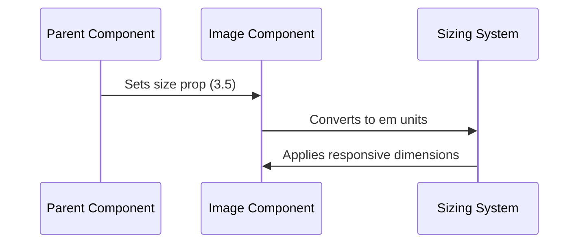

# Chapter 4: Responsive Sizing System

Building on our [Styled Components System](03_styled_components_system_.md), let's explore how to make our images resize beautifully across different contexts. Think of it like a smart photo frame that automatically adjusts its size while keeping everything in perfect proportion!

## Why Do We Need This?

Imagine you're building a photo gallery where you need to show:
- Small thumbnails in a grid view
- Medium-sized images in a profile
- Large images in a showcase
- All while maintaining consistent proportions!

## Understanding em Units

The secret to our responsive sizing system is the `em` unit. Think of `em` as a rubber band that stretches based on its context:
- 1em = the current font size
- If font size is 16px, then 3.5em = 56px
- If font size changes, everything scales proportionally!

## How to Use It

Here's a simple example:

```jsx
<Image 
  image="https://example.com/puppy.jpg"
  size={3.5}  // This means 3.5em
  canOpen={true}
/>
```

This creates an image that:
- Has width and height of 3.5em
- Automatically scales with its container
- Maintains a perfect square shape

## The Magic Behind It

Let's see how the sizing system works:



## Implementation Details

### 1. Size Interface
```jsx
interface ISize {
    size: number;  // Size in em units
}
```

### 2. Wrapper Component
```jsx
const Wrapper = styled.div<ISize>`
    position: relative;
    flex: 0;
    align-self: center;
`;
```
This creates a flexible container that centers our image.

### 3. Inner Wrapper with Responsive Sizing
```jsx
const InnerWrapper = styled.div<ISize>`
    width: ${props => props.size}em;
    height: ${props => props.size}em;
    overflow: hidden;
    border-radius: 12px;
`;
```
This maintains the square aspect ratio using em units!

## Working with Different Sizes

You can use different size values for different contexts:

```jsx
// Thumbnail
<Image size={2} image={url} />  // Small

// Profile picture
<Image size={3.5} image={url} /> // Medium

// Feature image
<Image size={5} image={url} />  // Large
```

## Integration with Other Systems

Our responsive sizing system works hand-in-hand with:
- [Image Component](01_image_component_.md) for basic display
- [Modal Preview System](02_modal_preview_system_.md) for full-size views
- [Animation Transitions](05_animation_transitions_.md) for smooth scaling

## Best Practices

1. **Keep Sizes Consistent**
```jsx
// Good - consistent sizing
const THUMBNAIL_SIZE = 2;
const PROFILE_SIZE = 3.5;

// Use throughout your app
<Image size={THUMBNAIL_SIZE} />
```

2. **Consider Context**
```jsx
// Adjust size based on usage
function ProfileCard({ isCompact }) {
  return <Image size={isCompact ? 2 : 3.5} />;
}
```

## Conclusion

You now understand how our Responsive Sizing System helps create perfectly proportioned images that adapt to any context - just like a smart photo frame that always looks perfect! Next up, we'll learn how to make these size changes look smooth with [Animation Transitions](05_animation_transitions_.md).

Remember: Good responsive design is like a well-tailored outfit - it looks great no matter the size!

---

Generated by [AI Codebase Knowledge Builder](https://github.com/The-Pocket/Tutorial-Codebase-Knowledge)