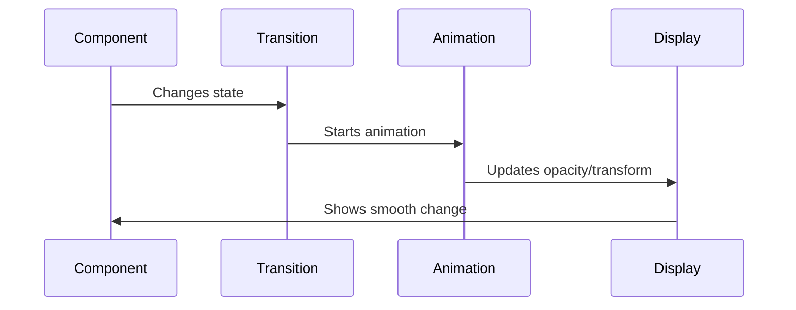

# Chapter 5: Animation Transitions

Building on our [Responsive Sizing System](04_responsive_sizing_system_.md), let's explore how to make our components move smoothly between states - like a graceful dance instead of abrupt jumps!

## Why Do We Need This?

Imagine you're clicking a thumbnail in our image gallery. Without animations, the modal would just pop up instantly - jarring! With animation transitions, it smoothly fades in, creating a delightful user experience. It's like raising the curtain in a theater rather than just yanking it open!

## Understanding the Basics

Animation transitions help us with:
- Fading elements in/out
- Sliding components
- Scaling images smoothly
- Making UI changes feel natural

## How to Use It

Here's a simple example using our MountTransition component:

```jsx
<MountTransition open={isOpen}>
  <div>This content will fade in smoothly!</div>
</MountTransition>
```

When `isOpen` changes from false to true, the content gracefully appears instead of just popping in!

## How It Works

Let's see what happens during a transition:



## Key Components

### 1. The MountTransition Component
```jsx
const MountTransition = styled.div<{ open: boolean }>`
  opacity: ${props => props.open ? 1 : 0};
  transition: opacity ${DEFAULT_ANIMATION_SPEED}ms ease-in-out;
`;
```
This creates our base transition effect - things fade in and out smoothly!

### 2. Animation Speed Configuration
```jsx
const DEFAULT_ANIMATION_SPEED = 200; // milliseconds
```
This sets how long our animations take - fast enough to feel snappy, but slow enough to be visible!

## Real-World Example

Let's see how it works with our [Modal Preview System](02_modal_preview_system_.md):

```jsx
<MountTransition open={open}>
  <PopupOverlay 
    duration={DEFAULT_ANIMATION_SPEED}
    onClick={() => setOpen(false)}
  >
    <GalleryWrapper>
      <ImageFull src={image} />
    </GalleryWrapper>
  </PopupOverlay>
</MountTransition>
```

This code:
1. Wraps our modal in a transition
2. Fades it in when `open` becomes true
3. Fades it out when `open` becomes false

## Integration with Other Systems

Our animation transitions work seamlessly with:
- [Image Component](01_image_component_.md) for smooth image loading
- [Modal Preview System](02_modal_preview_system_.md) for elegant popups
- [Styled Components System](03_styled_components_system_.md) for consistent animations

## Best Practices

1. **Keep Animations Short**
```jsx
// Good - quick and smooth
const SPEED = 200;

// Avoid - too slow
const SPEED = 1000;
```

2. **Use Consistent Timing**
```jsx
// Use the same speed for related animations
<MountTransition speed={DEFAULT_ANIMATION_SPEED}>
  <ContentA />
</MountTransition>

<MountTransition speed={DEFAULT_ANIMATION_SPEED}>
  <ContentB />
</MountTransition>
```

## Conclusion

You now understand how Animation Transitions make our UI changes smooth and delightful - like a well-choreographed dance! Next up, we'll learn how to track how users interact with our components in [Event Tracking](06_event_tracking_.md).

Remember: Good animations are like good manners - they make interactions more pleasant without drawing attention to themselves!

---

Generated by [AI Codebase Knowledge Builder](https://github.com/The-Pocket/Tutorial-Codebase-Knowledge)