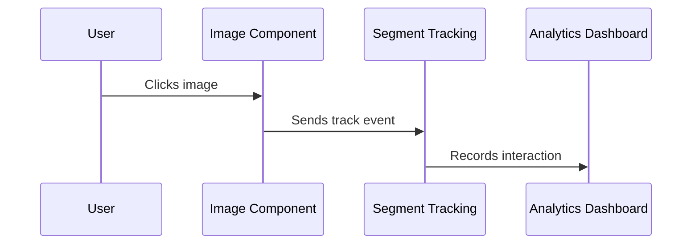

# Chapter 6: Event Tracking

Building on our [Animation Transitions](05_animation_transitions_.md), let's explore how to monitor user interactions with our images - like having a smart security camera that watches how people interact with our photo gallery!

## Why Do We Need This?

Imagine you run a photo gallery website and want to know:
- Which images users view most often
- When users close the full-size previews
- How people interact with different types of images
- What content is most engaging

This information helps you understand user behavior and improve your gallery!

## Understanding the Basics

Event tracking in our system uses Segment analytics, which works like a digital diary that records user actions. Here's how it works:

```jsx
// When user opens an image
segmentTrack("viewImage", imageUrl);

// When user closes the preview
segmentTrack("closeImagePreview");
```

## How to Use It

Here's a simple example:

```jsx
<Image 
  image="https://example.com/cat.jpg"
  trackEventName="viewCatPhoto"
  trackCloseEventName="closeCatPhoto"
  canOpen={true}
/>
```

This will:
- Track when users view the full-size cat photo
- Track when they close the preview
- Send this data to Segment for analysis

## How It Works

Let's see what happens when a user interacts with an image:



## Implementation Details

### 1. Tracking Configuration
```jsx
interface IImageProps {
  trackEventName?: string;
  trackCloseEventName?: string;
  // ... other props
}
```
These props let you specify custom event names for tracking.

### 2. Track Opening Events
```jsx
<OpenButton
  onClick={e => {
    setOpen(true);
    if (trackEventName) {
      segmentTrack(trackEventName, image);
    }
  }}
>
```
This tracks when users open the full-size view.

### 3. Track Closing Events
```jsx
<PopupOverlay
  onClick={() => {
    setOpen(false);
    segmentTrack(trackCloseEventName);
  }}
>
```
This tracks when users close the preview.

## Integration with Other Systems

Event tracking works seamlessly with:
- [Image Component](01_image_component_.md) for basic interactions
- [Modal Preview System](02_modal_preview_system_.md) for viewing events
- [Animation Transitions](05_animation_transitions_.md) for timing events

## Best Practices

1. **Use Descriptive Event Names**
```jsx
// Good
trackEventName="viewProductPhoto"
trackCloseEventName="closeProductPhoto"

// Avoid
trackEventName="click"
trackCloseEventName="close"
```

2. **Track Important Interactions**
```jsx
<Image 
  image={productImage}
  trackEventName="viewProductDetails"  // Important!
  size={3.5}
/>
```

## Conclusion

You now understand how Event Tracking helps you monitor and understand user interactions with your images - like having a smart assistant that takes notes on how people use your gallery!

Remember: Good event tracking is like having eyes on your application - it helps you understand how users interact with your content so you can make it even better!

This concludes our tutorial series on the `common` project. You now have all the tools you need to create beautiful, interactive, and trackable image galleries!

---

Generated by [AI Codebase Knowledge Builder](https://github.com/The-Pocket/Tutorial-Codebase-Knowledge)