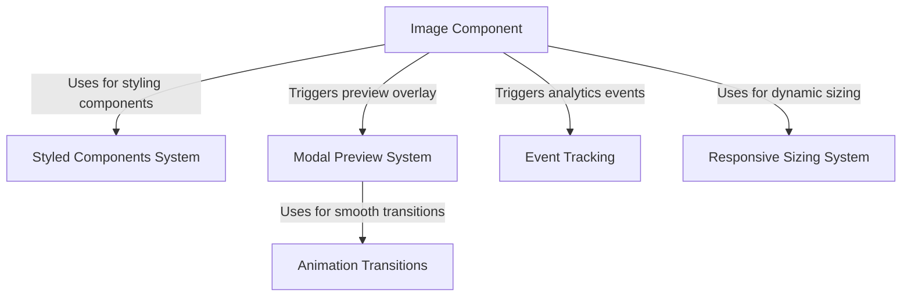

# Tutorial: common

This project implements a **sophisticated image viewing system** in React that allows users to display and preview images. The system features a *smart image component* that handles both thumbnail and full-screen views, with **smooth animations** and **responsive sizing**. It includes built-in *error handling* for missing images and integrates with **analytics tracking** to monitor user interactions. The styling is managed through a *styled-components system* that ensures consistent and customizable appearance.

**Source Repository:** [None](None)

## Chapters

1. [Image Component
](01_image_component_.md)
2. [Modal Preview System
](02_modal_preview_system_.md)
3. [Styled Components System
](03_styled_components_system_.md)
4. [Responsive Sizing System
](04_responsive_sizing_system_.md)
5. [Animation Transitions
](05_animation_transitions_.md)
6. [Event Tracking
](06_event_tracking_.md)

---

Generated by [AI Codebase Knowledge Builder](https://github.com/The-Pocket/Tutorial-Codebase-Knowledge)